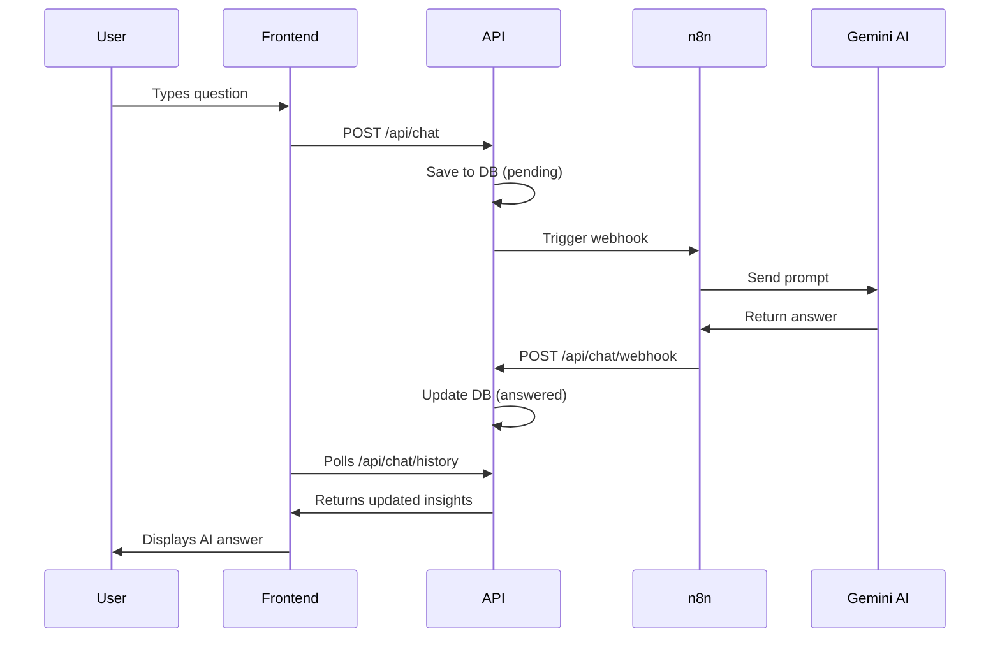

# The Smart Analyst 🕵️‍♂️📊

> **A Full-Stack Data Analytics Dashboard with AI-Powered Insights**

[](http://smart-analyst.72-62-67-226.nip.io)
[](https://github.com/Izenberk/agentic-dashboard/actions)
[](./docker-compose.yml)

## 🎯 Project Overview

A production-ready analytics dashboard where users can **visualize data** and **chat with an AI analyst**. This project demonstrates:

- **Full-Stack Development** (React + Bun/Elysia)
- **AI Integration** (n8n + Google Gemini)
- **DevOps & Deployment** (Bare Metal VPS, Nginx, Systemd, CI/CD)
- **Modern Tooling** (TypeScript, Tailwind, Turso)

## ✨ Features

| Feature | Description |
|---------|-------------|
| 📊 **Interactive Charts** | Real-time metrics visualization with Recharts |
| 🤖 **AI Chat Interface** | Ask questions about your data, get intelligent responses |
| 🔐 **User Authentication** | JWT-based auth with secure password hashing |
| 🌙 **Dark Mode** | Toggle between light/dark themes with localStorage persistence |
| 📱 **Responsive Design** | Mobile-friendly with collapsible sidebar |
| 📁 **CSV Import** | Upload your own data via CSV files |
| 📸 **Chart Export** | Download charts as PNG or PDF |
| 🔄 **CI/CD Pipeline** | Auto-deploy on push via GitHub Actions |
| 🔒 **Production Security** | SSL, SSH keys, UFW firewall |
| ⚡ **High Performance** | Bun runtime, edge database |

## 🏗️ Architecture

```
┌─────────────────────────────────────────────────────────────────┐
│                     Production Stack (Docker)                    │
├─────────────────────────────────────────────────────────────────┤
│  System Nginx (SSL)          →  Docker Client (port 8080)        │
│  ├── Let's Encrypt             ├── Nginx serving React SPA      │
│  └── Reverse Proxy             └── Proxies /api to Server       │
├──────────────────────────────────────────────────────────────────┤
│  Docker Server (port 3000)   │  n8n Workflow Engine             │
│  ├── Bun + ElysiaJS API      │  ├── Webhook Trigger             │
│  ├── TypeBox validation      │  ├── Google Gemini LLM           │
│  └── JWT authentication      │  └── Response Callback           │
├──────────────────────────────────────────────────────────────────┤
│  Database: Turso (LibSQL)    │  Hosted on Turso Cloud           │
└─────────────────────────────────────────────────────────────────┘
```

## 🛠️ Tech Stack

| Layer | Technology | Why |
|-------|------------|-----|
| **Runtime** | [Bun](https://bun.sh) | Fast startup, native TypeScript |
| **Backend** | [ElysiaJS](https://elysiajs.com) | Type-safe, high performance |
| **Frontend** | [React](https://react.dev) + [Vite](https://vitejs.dev) | Fast HMR, modern tooling |
| **Database** | [Turso](https://turso.tech) | Edge-replicated SQLite |
| **Styling** | [Tailwind CSS](https://tailwindcss.com) | Utility-first, rapid UI |
| **AI Workflow** | [n8n](https://n8n.io) | Visual workflow automation |
| **LLM** | Google Gemini | Fast, capable, free tier |
| **Deployment** | Ubuntu VPS + Nginx | Bare metal for learning |
| **CI/CD** | GitHub Actions | Auto-deploy on push |

## 🚀 Quick Start

### Prerequisites
- [Bun](https://bun.sh) installed
- [Turso CLI](https://docs.turso.tech/cli/installation) (for production)

### Local Development

```bash
# Clone the repo
git clone https://github.com/Izenberk/agentic-dashboard.git
cd agentic-dashboard

# Install dependencies
bun install

# Setup local database
bun run server/scripts/migrate.ts
bun run server/scripts/seed.ts

# Start backend (Terminal 1)
bun run server/src/index.ts

# Start frontend (Terminal 2)
cd client && bun run dev
```

Visit `http://localhost:5173`

### Docker Development

```bash
# Run with Docker (recommended)
docker compose up
```

Visit `http://localhost` (port 80)

## � Project Structure

```
agentic-dashboard/
├── client/                 # React frontend
│   ├── src/
│   │   ├── components/     # React components
│   │   └── lib/            # API client, contexts
│   ├── Dockerfile          # Multi-stage build
│   └── nginx.conf          # SPA routing + API proxy
├── server/
│   ├── src/
│   │   ├── index.ts        # Elysia API server
│   │   └── schema-v2.sql   # Multi-tenant schema
│   ├── scripts/
│   │   └── migrate-v2.ts   # Schema migration
│   └── Dockerfile          # Bun multi-stage build
├── packages/
│   └── shared-types/       # @agentic/shared-types
│       └── src/index.ts    # Re-exports App type
├── docker-compose.yml      # Container orchestration
├── nginx-vps.conf          # VPS Nginx template
├── .github/workflows/
│   └── deploy.yml          # CI/CD pipeline
└── README.md
```

## 🔄 How It Works



## 🏰 Production Deployment

Deployed on **Hostinger VPS** using Docker:

| Component | Implementation |
|-----------|----------------|
| **OS** | Ubuntu 24.04 LTS |
| **Containers** | Docker Compose |
| **Reverse Proxy** | System Nginx (SSL via Certbot) |
| **Frontend** | Docker (Nginx:8080) |
| **Backend** | Docker (Bun:3000) |
| **n8n** | Docker container |
| **Database** | Turso Cloud |
| **CI/CD** | GitHub Actions → Docker Compose |

### Security Measures
- ✅ Root login disabled
- ✅ SSH key-only authentication
- ✅ UFW firewall (ports 22, 80, 443 only)
- ✅ HTTPS everywhere (Let's Encrypt)

## 📊 API Endpoints

| Endpoint | Method | Description |
|----------|--------|-------------|
| `/health` | GET | Health check (uptime, status) |
| `/api/auth/register` | POST | Create new user account |
| `/api/auth/login` | POST | Authenticate and get JWT |
| `/api/auth/me` | GET | Get current user info |
| `/api/metrics` | GET | Fetch all metrics data |
| `/api/metrics/import` | POST | Bulk import metrics from CSV |
| `/api/chat` | POST | Submit a question |
| `/api/chat/webhook` | POST | Callback from n8n |
| `/api/chat/history` | GET | Get all insights |

## 🧪 Testing

```bash
# Health check
curl http://smart-analyst.72-62-67-226.nip.io/health

# Get metrics (requires auth)
curl http://smart-analyst.72-62-67-226.nip.io/api/metrics
```

## 📝 License

MIT

---

Built with ❤️ as a learning project to master full-stack development and DevOps.
